# Technical documentation
## General architecture

The project is separated into a few main modules:



- Note source: responsible for sourcing note events and forwarding them to other modules
- Voice scheduler: responsible for updating the voice table according to received note events
- Voice table: the central data structure, containing the state of all voices
- Synthesizer: responsible for generating the sound for all voices
- Gui: responsible for drawing the user interface and handling the user's interaction with it

## Note source

This module is the least clear-cut one, since there are two sources
implemented. One is the midi port input handler, which resides in
`midi.c`, and the other is the on-screen keyboard residing in
`gui/keyboard.c`, which also handles drawing the keyboard and handling
input.

The main means of communication is the queue `note_events` (declared
in `note_source.h`), where values of type `note_event` are inserted.
Structure `note_event` is defined as follows:

```c
typedef enum { NE_DOWN, NE_UP } note_event_type;

typedef struct {
    uint8_t pitch;
    uint8_t velocity;
    note_event_type type;
} note_event;
```

The meaning of each field is:

- `pitch`: The midi number of the note (A0 is 21, G9 is 127)
- `velocity`: The midi velocity of the event (1 is the softest, 127 is the loudest)
- `type`: `NE_DOWN` for a key press event, `NE_UP` for a key release event

### On-screen Keyboard

The on-screen keyboard is implemented in `gui/keyboard.c`. It's too
small and inaccurate for any serious playing, but it's good enough for
trying out how the synthesizer sounds without an external MIDI
keyboard.

Unfortunately a simple method of tracking presses based on touch
number does not work properly, as when one press is released, touch
numbers of other ongoing presses change. As such, on every touch
change a set of pressed keys is built (stored in a simple array) and
compared to the set of previous pressed keys. For any new element a
key down event is sent, and for any key that's no longer present a key
up event is sent. These events are sent directly into the
`note_events` queue.

### MIDI port

The midi receiver uses the usart 6 interface. A simple receiver
circuit with an optoisolator is required, as per the midi
specification.


Power and ground should be connected to pins marked respectively 5V
and GND in the arduino-compatible connector. The RX label has to be
connected to the rx pin of usart6 interface, which is pin marked D0
on the connector.

It is worth mentioning, that even though the microcontroller on the
board normally works in 3.3V logic, almost all its pins are labeled as
5V-tolerant in the specification. As such, there should be no problems
with using a 5V optoisolator.

The midi communication uses a standard uart protocol with baud rate of
31250 bits per second. The only required configuration was to enable
usart6 in asynchronous mode, set the correct baud rate and enable the
USART6 interrupt.

I couldn't get the HAL routines for interrupt-based uart read to work,
so i had to implement a workaround. I created a custom interrupt
handler routine `midiIRQ` that's called from `USART6_IRQHandler`
before the HAL built-in handler. This routine just sends the byte from
the Read Data Register (RDR) into the `midi_bytes` queue. To initiate
receive a bit in the usart control register has to be set as seen in
the function `receiveByte()` in `midi.c`. This line has been copied
from the HAL receive routine.

For MIDI message decoding a last command byte is kept in a global
variable. The message length is computed based on that byte. When
enough bytes arrive, the message is decoded and dispatched. Channel of
the messages is ignored.

Supported MIDI messages:

- Note off (#8x)
- Note on (#9x)
- Control Change (#Bx)

All other commands are ignored.

MIDI Control change commands go through an additional layer of
indirection we call _controls_. Controls keep the data about range and
step of all parameters, so that it is not duplicated in MIDI module
and in GUI. The midi control value within range 0..127 is translated
to the floating point range of 0.0..1.0 and then into the appropriate
range for the control.

## Voice Table

Voice table is the central data structure of the system. It contains
all state required by synthesis modules.

```c
// In file structures.h
typedef struct {
    bool active;
    uint8_t note;
    uint8_t velocity;
    oscillator_state osc[OSCILLATOR_COUNT];
    envelope_state env;
    int16_t samples[VOICE_BUFFER_SIZE];
} voice_entry;

// In file voice_scheduler.h
extern voice_entry voice_table[VOICE_COUNT];
```

- `active`: Determines, if there is any active note assigned to this
  voice, synthesizer is only run on active voices.
- `note`: MIDI pitch of the active note
- `velocity`: MIDI velocity of the note down event
- `osc`: array of oscillator state data, one for each oscillator (at
  the moment two)
- `env`: envelope state data
- `samples`: the buffer for generated sound data. Each synthesis
  module writes to, or modifies the data contained in it

## Voice Scheduler

The voice scheduler is responsible for handling incoming note events by
changing the state of the voice table. The scheduler polls the `note_events`
queue in a loop, only waking up when new note events are available.

On each key press event, the scheduler iterates through the voice table,
attempting to find an inactive voice. If all voices are currently active,
the scheduler then attempts to fall back to the least audible of all voices
in the `ENVELOPE_RELEASE` stage - that is, a voice assigned to a note which
is no longer held and is meant to slowly fade away over time. If no such
voice is available, the note event is discarded.

When an available voice is found, its oscillator and envelope settings are reset
to their default values. The pitch and velocity information is then copied
from the `note_event` structure into the voice table entry and the voice is
set to active.

On each key release event, the scheduler attempts to find an active voice
currently playing a note of the pitch specified in the `note_event` structure.
If a matching voice is found, the `released` envelope flag is set to true,
signaling the envelope to transition to the `ENVELOPE_RELEASE` stage. Otherwise,
the note event is discarded.

## Synthesizer

Synthesis is implemented in a modular fashion. It is divided into
submodules, which are invoked in order. We only managed to make two
modules, but further expansion should be possible with minimal
ingerence in other modules.



Each submodule has its data stored in two places. One is the voice
table mentioned above, which stores ephemeral state, that can differ
between voices. The other is `current_settings`, which stores user
settings, which should be stored as part of a preset, should such
feature be implemented.

```c
typedef struct {
    oscillator_settings osc[OSCILLATOR_COUNT];
    envelope_settings env;
} settings;

extern settings current_settings;
```

### Oscillator

The two oscillators are the first step in synthesis pipeline. They
calculate samples based on the period (known from the pitch of the
note) and phase stored in the oscillator per-voice state.

```c
typedef struct {
    uint32_t phase;
} oscillator_state;
```

Counting phase as with resolution of a single sample prooved to be
insufficiently precise, as the error in higher notes could even exceed
a semitone. As such, the implementation uses fixed-point arithmetic,
which just means, that instead of samples, phase is counted in
fractions of a sample.

```c
typedef struct {
    float shape;
    float amplitude;
    float tune;
    float velocity_response;
} oscillator_settings;
```

The oscillators have independent settings (as seen in the definition
of the `settings` structure).
TODO shape images
- `shape`: Shape of the generated waveform. Allowed values are:
  - Sine (0.0)
  - Square (1.0)
  - Sawtooth (2.0)
  - Pulse (3.0), with duty cycle of 10%
  - Triangle (4.0)
- `amplitude`: Amplitude of the waveform, between 0.0 and 1.0
- `tune`: Value added to the pitch of the note, in semitones
- `velocity_response`: How much velocity of the note affects generated
  amplitude. With maximum velocity the amplitude is always equal to
  the amplitude setting. With zero velocity, when velocity response is
  1.0 the oscillator is silent, and when it is 0.0 the amplitude is
  unaffected.

The samples generated by oscillators are added together.

All generation is implemented using simple integer arithmetic. Using
floats might have been simpler, but as the synthesis is in a very
performance-sensitive loop, we decided to keep it as performant as
possible. We don't know wether this was a premature optimisation or
not.

### Envelope

The waveform generated by the two oscillators is subsequently processed by
the envelope submodule. The envelope is responsible for simulating the way
a sound changes over time when played on a non-electronic analogue
instrument - for instance, when a piano key is pressed, the sound increases
in level rapidly before falling back to a constant level which is maintained for
as long as the key is held, and then fades away slowly once the key is released.

In this project, we use the most popular ADSR envelope generation model. After
becoming activated, each voice goes through the following envelope stages
in order:
- attack - represents the sound level rising from 0 to peak immediately after
  the key is pressed,
- decay - represents the sound falling from peak to sustain level once the
  attack stage ends,
- sustain - represents the sound staying at a constant amplitude until the
  key is released,
- release - represents the sound fading away after the key is released.

The `envelope_process(voice_entry*)` function is responsible for scaling
down the values of samples generated by the two oscillators to match the
expected sound level and for advancing the envelope stage, if necessary.
During the attack, decay, and release stages, the expected level changes
linearly over time. In the sustain stage, the level remains constant.

```C
typedef struct {
    envelope_stage stage;
    uint16_t cycles;
    uint32_t level;
    bool released;
} envelope_state;
```

For each voice, the envelope module stores the following data relating to its
epehemeral state:
- `stage` - represents the current envelope stage. One of `ENVELOPE_ATTACK`,
  `ENVELOPE_DECAY`, `ENVELOPE_SUSTAIN`, `ENVELOPE_RELEASE`, or `ENVELOPE_SILENT`,
- `cycles` - the number of waveform generation cycles since the beginning
  of the current stage,
- `level` - the level at the end of the last generation cycle. Used by the
  voice scheduler to determine the least audible voice when no inactive voices
  are available,
- `released` - a boolean flag set to `true` when the note is released, signaling
  the envelope to advance from the sustain stage to the release stage.

```C
typedef struct {
    float attack_time;
    float decay_time;
    float sustain_level;
    float release_time;
} envelope_settings;
```

The duration of the attack, decay, and release stages and the sound level
maintained during the sustain stage can be configured by changing the values
of the appropriate fields in the `envelope_settings` structure:
- `attack_time` - the duration of the attack stage in seconds,
- `decay_time` - the duration of the decay stage in seconds,
- `sustain_level` - the sustain level to peak level ratio, between 0.0 and 1.0,
- `release_time` - the duration of the release stage in seconds.

If the duration of any of the stages should be zero - either because the
`attack_time`, `decay_time`, or `release_time` was set to 0, because the
`sustain_level` is set to 0 or because the note was released before the
beginning of the sustain stage - the appropriate stage is skipped entirely
and the envelope module advances to the next stage on the same generation cycle.

### Mixer

After samples are generated for all voices, the mixer just has to sum
them to a single buffer. Afterwards they are sent to the sound codec chip.

### Sound output

The samples from mixer are written into `audio_out_buffer`. This
buffer is set as DMA transfer source for the sound chip. Layout of
this buffer is a bit unusual, and figuring it out was not trivial. For
any time instant there are four samples. The first and third are
respectively the left and right channel for headphones, and the second
and fourth are inaudible, probably because they are for the speaker
output, which is not soldered to anything by default.

Mixer only writes to a half of the buffer, while the other half is
being played. This is handled by interrupts triggered when DMA
transfer reaches half of the buffer, or the end. The interrupt
handlers (`BSP_AUDIO_OUT_TransferComplete_CallBack` and
`BSP_AUDIO_OUT_HalfTransfer_CallBack` defined in `synthesizer.c`) set
the global variable `buffer_position` appropriatly and notify the
synthesis task using RTOS task notifications.

The synthesis task just invokes synthesis and mixing in an infinite
loop, waiting for notification before each iteration.

In our project we restart the DMA transfer every time it completes,
but as i later found out it would be enough to enable cyclical
behaviour in the dma settings for that channel.

## GUI

The GUI module is responsible for displaying the current configuration on-screen
and allowing the user to modify the settings and test them out without the use
of an external MIDI keyboard.

The STM32F746G-DISCO board is equipped with a 480×272 color LCD screen with a
capacitive multi-touch panel. For the purposes of this project, we used the BSP
API in order to draw screen elements and handle touch events. As the GUI part
of our project only plays a supplementary role, we refrained from using any
advanced GUI libraries, instead opting to provide our own lightweight
implementation of buttons and sliders, thus eliminating the risk of unnecessary
memory overhead or performance drop.

In the naming convention we adopted for the purposes of this module, functions
with names beginning with the `draw` prefix are responsible for drawing GUI
elements on screen, while functions with names beginning with the `view` prefix
handle user input and call the appropriate `draw` functions whenever refreshing
a part of the screen is necessary. All other functions defined in this module
serve an auxilliary role.

At any given time, the GUI can be in one of two states: it can display the main
screen or one of the configuration panel screens.

The main purpose of the main screen is navigation - it allows the user to switch
between different configuration panels by double-tapping one of the miniature
displays. The main screen is also where the on-screen keyboard is displayed,
allowing users to quickly test out the settings when they return from one of
the configuration panels.

```C
typedef struct ConfigPanel {
    Rect bounds;
    Slider* sliders;
    uint8_t sliderCount;
    uint8_t highlightedSlider;
} ConfigPanel;
```

The configuration panels (`ConfigPanel`) display a set of sliders related to
a single part of the system - for instance, the envelope submodule or one of the
oscillators. Each slider is bound to one of the `control` structures as defined
in `controls.c`. The latest slider tapped by the user is designated as the
"highlighted" slider and is drawn in a slightly different style to indicate
that it is active.

```C
//controls.h
typedef struct {
    float min;
    float max;
    float step;
    float* value;
    bool dirty;
} control;

//gui.c
typedef struct Slider {
    uint16_t posX;

    control* ctrl;
    bool mutable;
    char* label;
} Slider;
```

The `control` structure defines the properties of a single parameter of the
system which are logically independent from the display:
- `min` - defines the minimal valid value for this parameter,
- `max` - defines the maximal valid value for this parameter,
- `step` - defines the increment by which the value of this parameter is
  changed. At any given point, the value should differ from `min` by a multitude
  of `step`.
- `value` - pointer to the appropriate system parameter,
- `dirty` - a boolean flag indicating that the value of this property has been
  changed and the associated slider must be redrawn.

The `Slider` structure supplements a `control` with data only useful when
drawing the slider:
- `posX` - indicates the x position of the slider on the settings panel screen,
- `label` - defines the description drawn above the slider.

The introduction of a separate `control` structure means that other modules
(such as the MIDI receiver) can modify the system properties freely without
unnecessary dependecies on the GUI implementation. At the same time, the `dirty`
flag allows us to update the display values of the sliders in real time.

Note that unlike the rest of the project, a large part of the calculations
involved in drawing the GUI elements and handling slider events is performed
using floating-point arythmetic. As these calculations are only launched when
new user input is received, their effect on the overall performance of the
system is negligible.

## Possible expansions

There are many opportunities for expansion in this project. Here, we
list just a few possible ideas for anyone that would want to improve
emboard:

### More synthesis modules

While the current model is a bit simplistic, adding a few simple
effects to the synthesis pipeline could make it sound a lot more
sophisticated, and would allow the user to get closer to the sound
they want to achieve. Some of the possible additions are:

- FIR/IIR filter
- Delay
- Reverb
- Modulation (AM/FM)
- LFO for volume, pitch etc

### Standard MIDI file playback

As it stands, emboard is pretty useless without an external midi
instrument. The on-screen keyboard, while functional, is not a viable
interface for a musician. This would change, if the device could play
back midi files stored on an SD card, or a usb flash drive. This could
also make it a great demonstration toy, as it could be left on display
playing some tune on repeat.

### Persistent presets

When a user finds a sound they like, it would be great if they could
save it, to recreate it later. This could be achieved with the
on-board flash memory, or even files on an sd card, which could then
later be shared with other users. Support for MIDI program change
messages could also be included, to switch between presets quickly.

## Sources

These are the resources we used during creation of emboard:

- [STM32 Cube MX](https://www.st.com/en/development-tools/stm32cubemx.html)
- [FreeRTOS documentation](https://www.freertos.org/)
- [Board and μcontroller Documentation](https://www.st.com/)
- [MIDI specification](https://www.midi.org/specifications)
- [GCC](https://developer.arm.com/tools-and-software/open-source-software/developer-tools/gnu-toolchain/gnu-rm/downloads)
- [OpenOCD](http://openocd.org/)
- [GNU Emacs](https://www.gnu.org/software/emacs/)
