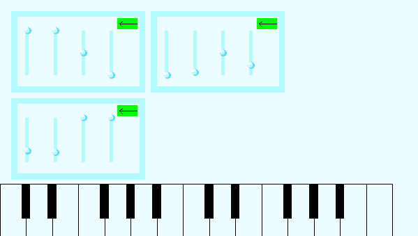
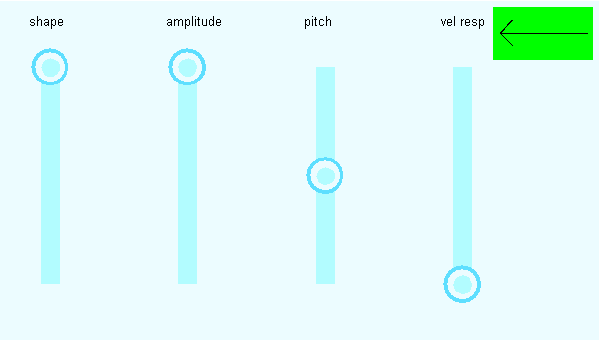

# User's manual

## What is emboard?

[emboard](index.md) is an implementation of a simple digital synthesizer for the
STM32F746G-DISCO embedded platform. The synthesizer accepts MIDI input via a
dedicated DIN-5 connector and outputs the generated soundwave via a standard
audio jack. It allows the customization of the audio settings through an
intuitive touchscreen interface or MIDI keyboard controls.

## Getting started

### Prerequisites

The compilation and programming process assumes that a copy of the
arm-none-eabi-gcc compiler is installed locally and added to the PATH system
variable.

You can download the most recent copy of the GNU Embedded Toolchain for Arm
from the [official download page](https://developer.arm.com/tools-and-software/open-source-software/developer-tools/gnu-toolchain/gnu-rm/downloads)
at [developer.arm.com](https://developer.arm.com/).

### Compilation and programming

1. Download the source code for the project. You can either clone the GitHub
   repository or download the source code as a ZIP archive.
2. Open the project directory in the command prompt of your choice.
3. Compile the project by invoking `make` or `make all`.
4. Connect the STM32F746G-DISCO board to your computer through a USB-to-mini-USB
   cable, then run `make program`.
5. Once the programming process is finished, the main screen of the
   configuration GUI should show up on the touchscreen.

### Testing the sound

Once the board is programmed correctly, plug in the audio output of your
choice - usually a headphone set or a speaker system - to the audio output
jack. Play a few notes on the on-screen keyboard to check if the system
is configured correctly. You may adjust the volume of the output by changing the
amplitude values in the oscillator settings.

### Using MIDI input.

Although you can play both single notes and chords on the synthesizer in real
time by using the on-screen keyboard, it's mostly designed for the purposes of
testing out the audio generation settings.

For a more ergonomic experience, you can plug in a MIDI source of your choice,
such as a MIDI keyboard, using a standard DIN-5 connector. As a MIDI receiver
is not a part of the STM32F746G-DISCO board, the diagram of a simple receiver
circuit is included in the technical documentation for this project.

## Settings

The emboard synthesizer allows for the free customization of audio generation
settings at runtime using either the touchscreen interface or MIDI controls.

### Main screen

The main screen is presented immediately after programming the board. It
allows you to switch between the configuration panels for different subsystems:
- the primary oscillator (top left),
- the secondary oscillator (bottom left),
- the ADSR envelope (top right).

To switch between the configuration panels, double tap one of the presented
miniatures.

In addition to configuration panels, the main screen also features an
on-screen keyboard, allowing for quick and easy sound testing when modifying the
settings.

### Primary oscillator

The primary oscillator is responsible for the main part of the generated sound,
including the shape of the generated waveform, its amplitude, and tune.

You can affect the output of the oscillator by adjusting one of the following
settings (presented left to right):
- **shape** - the shape of the generated waveform; the base shapes from top to
  bottom are *Pulse*, *Square*, *Sawtooth*, *Triangle*, and *Sine*, with
  intermediate values interpreted as intermediate waveforms (more details can be
  found in the technical documentation),
- **amplitude** - determines the volume of the generated audio,
- **pitch** - the base pitch added to the pitch of each played note,
- **vel resp** - short for velocity response, i.e. the value representing how
  much the velocity of the played note affects the amplitude of that note.

### Secondary oscillator

Just like the primary oscillator, the secondary oscillator generates a waveform
based on notes coming from the MIDI input or the on-screen keyboard. The
settings of the two oscillators are completely independent from each other and
the output of the oscillators is mixed together.

The intent is for the secondary oscillator to complement the output of the first
oscillator to make the generated output richer and more varied. For instance,
you may wish to assign a different velocity response value for both oscillators
so that the generated sound is audibly different depending on the velocity of
the notes.

### The ADSR envelope

The ADSR envelope subsystem makes the sound generated by the two oscillators
more realistic by simulating the way the sound changes over time when a note
is played.

When a note is played on a MIDI keyboard or the on-screen keyboard, the
amplitude of the generated sound rises from 0 to the max value over time (this
is called the *attack stage*). It then proceeds to fall to a constant level
(*decay stage*), which is maintained for as long as the key is held
(*sustain stage*). Once the key is released, the note slowly fades away until
it becomes inaudible (*release stage*).

The output of the ADSR envelope can be altered by adjusting one of the
following settings (left to right):
- **A** - the duration of the *attack stage*, in seconds,
- **D** - the duration of the *decay stage*, in seconds,
- **S** - the amplitude of the generated sound during the *sustain stage*,
- **R** - the duration of the *release stage*, in seconds.

Note that setting some of those values to 0 will result in skipping one or more
of the stages described above. This may be used to good effect due to the
interesting and unique structure of the generated sound, but should be used
sparingly, as it ultimately defies the purpose of the envelope module's
existence.

## Further information

For more information on the emboard project, check out the
[technical documentation](technical.md).
